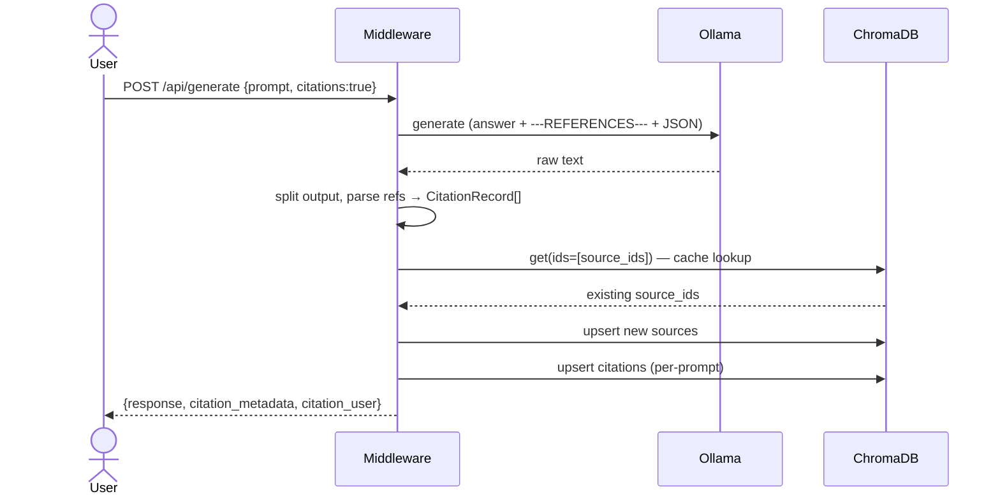

# Citation Extraction Pipeline for Ollama + Gemma 3

[](LICENSE)

A lightweight middleware proxy between your Ollama client and an Ollama
backend (Gemma 3). When a prompt is sent with `citations: true`, the
middleware asks the LLM to emit both its natural-language answer **and**
a structured JSON list of every source it relied on, then reconciles those
sources against a ChromaDB cache before returning the response.

## Design principles

- **LLM is the source of truth** for which references were used.
  No web scraping, no PDF parsing, no regex bibliography detection.
- **Single Ollama call** per user prompt. One pass, `temperature=0.0`.
- **ChromaDB as cache**, not vector search. `source_id` lookup is `collection.get()` — O(1), no embeddings on the hot path.
- **Inline reconcile**. Sources are checked + upserted into ChromaDB
  **before** the response reaches the user, so the returned
  `citation_metadata` matches what's stored.
- **A2A-compatible envelope** — another agent can parse `citation_metadata` directly.

## Architecture

```
┌──────────┐     ┌────────────────────────┐     ┌────────────┐
│  Client  │────▶│  Citation Middleware   │────▶│   Ollama   │
│          │◀────│  (FastAPI, :8000)      │◀────│  Gemma 3   │
└──────────┘     └───────────┬────────────┘     └────────────┘
                             │
                             ▼
                      ┌────────────┐
                      │  ChromaDB  │
                      │ (embedded) │
                      │            │
                      │ sources    │
                      │ citations  │
                      └────────────┘
```

## Pipeline (citations=true)



## Data model

**`sources` collection** — global dedup table
- id: `source_id` = sha256 of (`doi` → else normalized `url` → else title+authors)
- metadata: `title, canonical_ref, source_type, first_prompt_id, first_seen_at`

**`citations` collection** — per-prompt records linked to sources via `source_id`
- id: `cid` = sha256 of (title + sorted authors + date)
- metadata: `cid, source_id, prompt_id, title, authors_json, date_published, publisher, doi, access_url, citation_style, confidence, created_at`

## Quick Start

```bash
# 1. Install
pip install -r requirements.txt

# 2. Verify Ollama is running with a Gemma 3 model
ollama list   # expect gemma3:1b or similar

# 3. Run tests (no Ollama, no ChromaDB required)
PYTHONPATH=. python tests/test_pipeline.py

# 4. Start the middleware
PYTHONPATH=. uvicorn middleware.proxy:app --host 0.0.0.0 --port 8000
```

### Transparent pass-through (citations=false)

```bash
curl http://localhost:8000/api/generate \
  -d '{"model":"gemma3:1b","prompt":"What is deep learning?"}'
```

### With citations

```bash
curl http://localhost:8000/api/generate \
  -d '{"model":"gemma3:1b","prompt":"What is attention in neural networks?","citations":true}'
```

Response shape:

```json
{
  "model": "gemma3:1b",
  "response": "Attention mechanisms allow neural networks to...",
  "_prompt_id": "a1b2c3d4-...",
  "citation_metadata": {
    "schema": "citation_extraction",
    "version": "1.0",
    "prompt_id": "a1b2c3d4-...",
    "total_citations": 1,
    "citations": [
      {
        "type": "citation_record",
        "cid": "a7f3...",
        "source_id": "b2e1...",
        "source_cached": false,
        "title": "Attention Is All You Need",
        "authors": ["Vaswani, A.", "Shazeer, N."],
        "date_published": "2017",
        "publisher": "NeurIPS",
        "doi": "10.48550/arXiv.1706.03762",
        "access_url": null,
        "source_type": "conference_paper",
        "citation_style_detected": "APA",
        "discovery_method": "llm_training_knowledge",
        "confidence": 0.95
      }
    ]
  },
  "citation_user": {
    "prompt_id": "a1b2c3d4-...",
    "citations": [{"title": "...", "authors": [...], "doi": "...", "url": null}]
  }
}
```

The `source_cached` field tells downstream agents whether the source was
already known to this deployment before the prompt ran.

### Retrieve by prompt

```bash
curl http://localhost:8000/api/citations/{prompt_id}
```

### Semantic search across stored citations

```bash
curl http://localhost:8000/api/citations/search/attention%20mechanisms
```

## LLM output contract

The middleware instructs the model (via system prompt in
[core/extractor.py](core/extractor.py)) to produce:

```
<free-form answer>
---REFERENCES---
[{"title": "...", "authors": [...], "date": "...", "source_type": "...",
  "citation_style": "...", "publisher": "...", "doi": "...", "url": "...",
  "raw_fragment": "...", "confidence": 0.0}]
```

If the marker is missing, the answer is returned whole and references
default to `[]` — graceful degradation.

## File layout

```
citation-pipeline/
├── config.py                 Ollama + ChromaDB settings (single source of truth)
├── core/
│   ├── models.py             CitationRecord, Source, compute_source_id, A2A views
│   └── extractor.py          Single-call Ollama extractor + output parser
├── middleware/
│   └── proxy.py              FastAPI endpoints + inline reconcile flow
├── storage/
│   └── store.py              ChromaDB store with two collections + reconcile
├── ollama_patch/
│   └── Modelfile             Optional citation-aware model tag
├── tests/
│   └── test_pipeline.py      Unit tests (no Ollama / Chroma required)
├── docker-compose.yml        Ollama + middleware
├── Dockerfile                Middleware image
└── requirements.txt          fastapi, uvicorn, aiohttp, chromadb, pydantic
```
