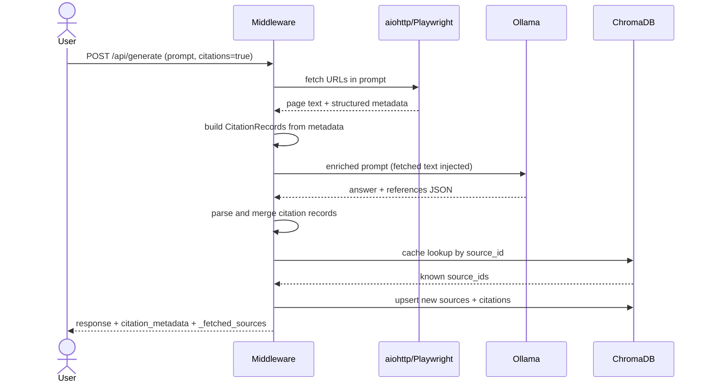

# Citation Extraction Pipeline for Ollama + Gemma 3

[](LICENSE)

A middleware proxy between an Ollama client and a Gemma 3 backend. When a
prompt arrives with `citations: true`, the pipeline fetches any URLs in the
prompt, injects their content into the LLM context, asks the model for a
structured answer-plus-references block, and reconciles every cited source
against ChromaDB — all before the response returns to the caller.

An interactive REPL (`app.py`) drives the full pipeline from a terminal:
type a prompt, read the model's prose answer and a compact metadata summary,
review up to three citation records inline, and find the complete JSON payload
saved to `results/` for later inspection.

## How it works

- **One LLM call per prompt** — the model returns a natural-language answer
  and a structured JSON references block together, single pass,
  `temperature=0.0`. The system prompt requires the model to cite its
  training-knowledge sources for factual answers even when the prompt
  contains no URLs.
- **Server-side URL fetch** — URLs found in the prompt are fetched before the
  LLM call. Static pages use aiohttp; JS-rendered pages (arXiv, Nature,
  Springer) fall back to headless Chromium via Playwright. The fetched text is
  injected as a `<fetched_sources>` block so the model cites real, retrieved
  content.
- **Inline source deduplication** — each citation is assigned a stable
  `source_id` (DOI → normalised URL → title+authors hash) and checked against
  ChromaDB in the same request. New sources are inserted and `source_cached`
  is set before the response reaches the caller.
- **Resilient reference parsing** — the extractor handles non-standard section
  headers (`**REFERENCES:**`, `## References`, …) and recovers plain URL lists
  into structured citation records when the model omits the JSON block.
- **A2A-ready envelope** — `citation_metadata` is a structured payload a
  downstream agent can parse directly.

## Architecture

```
┌──────────┐     ┌────────────────────────┐     ┌────────────┐
│  Client  │────▶│  Citation Middleware   │────▶│   Ollama   │
│          │◀────│  (FastAPI, :8000)      │◀────│  Gemma 3   │
└──────────┘     └───────────┬────────────┘     └────────────┘
                             │
                             ▼
                      ┌────────────┐
                      │  ChromaDB  │
                      │ (embedded) │
                      │            │
                      │ sources    │
                      │ citations  │
                      └────────────┘
```

## Pipeline (citations=true)



## Data model

**`sources` collection** — global dedup table
- id: `source_id` = sha256 of (`doi` → else normalized `url` → else title+authors)
- metadata: `title, canonical_ref, source_type, first_prompt_id, first_seen_at`

**`citations` collection** — per-prompt records linked to sources via `source_id`
- id: `cid` = sha256 of (title + sorted authors + date)
- metadata: `cid, source_id, prompt_id, title, authors_json, date_published, publisher, doi, access_url, citation_style, confidence, created_at`

## Quick Start

```bash
# 1. Install
pip install -r requirements.txt

# 2. Verify Ollama is running with a Gemma 3 model
ollama list   # expect gemma3:1b or similar

# 3. Start the middleware
PYTHONPATH=. uvicorn middleware.proxy:app --host 0.0.0.0 --port 8000
```

> **Gemma 3:1b token limits** — 32 768-token context window (full native capacity).
> The pipeline sets `num_ctx=32768` and `num_predict=4096` by default, both
> overridable via `OLLAMA_NUM_CTX` / `OLLAMA_NUM_PREDICT` env vars.

### Transparent pass-through (citations=false)

```bash
curl http://localhost:8000/api/generate \
  -d '{"model":"gemma3:1b","prompt":"What is deep learning?"}'
```

### With citations

```bash
curl http://localhost:8000/api/generate \
  -d '{"model":"gemma3:1b","prompt":"What is attention in neural networks?","citations":true}'
```

Response shape:

```json
{
  "model": "gemma3:1b",
  "response": "Attention mechanisms allow neural networks to...",
  "_prompt_id": "a1b2c3d4-...",
  "_total_ms": 8421,
  "citation_records_count": 1,
  "citation_metadata": {
    "schema": "citation_extraction",
    "version": "1.0",
    "prompt_id": "a1b2c3d4-...",
    "user_query": "What is attention in neural networks?",
    "total_citations": 1,
    "citations": [
      {
        "type": "citation_record",
        "cid": "a7f3...",
        "source_id": "b2e1...",
        "source_cached": false,
        "title": "Attention Is All You Need",
        "authors": ["Vaswani, A.", "Shazeer, N."],
        "date_published": "2017",
        "publisher": "NeurIPS",
        "doi": "10.48550/arXiv.1706.03762",
        "access_url": null,
        "source_type": "conference_paper",
        "citation_style_detected": "APA",
        "discovery_method": "llm_training_knowledge",
        "confidence": 0.95
      }
    ]
  },
  "citation_user": {
    "prompt_id": "a1b2c3d4-...",
    "citations": [{"title": "...", "authors": [...], "doi": "...", "url": null}]
  }
}
```

The `source_cached` field tells downstream agents whether the source was
already known to this deployment before the prompt ran.

### Retrieve by prompt

```bash
curl http://localhost:8000/api/citations/{prompt_id}
```

### Semantic search across stored citations

```bash
curl http://localhost:8000/api/citations/search/attention%20mechanisms
```

## LLM output contract

The middleware instructs the model (via system prompt in
[core/extractor.py](core/extractor.py)) to produce:

```
<free-form answer>
---REFERENCES---
[{"title": "...", "authors": [...], "date": "...", "source_type": "...",
  "citation_style": "...", "publisher": "...", "doi": "...", "url": "...",
  "raw_fragment": "...", "confidence": 0.0}]
```

If the marker is missing the parser tries common markdown header variants
before falling back to URL extraction — a partial result is always returned
in preference to an empty array.

## File layout

```
citation-pipeline/
├── app.py                    Interactive REPL client (stdlib only)
├── config.py                 Ollama + ChromaDB + web-fetch settings
├── core/
│   ├── models.py             CitationRecord, Source, compute_source_id, A2A views
│   ├── extractor.py          Single-call Ollama extractor + resilient output parser
│   └── web_fetch.py          URL fetcher (aiohttp + Playwright), HTML→text, metadata extraction
├── middleware/
│   └── proxy.py              FastAPI endpoints + inline reconcile flow
├── storage/
│   └── store.py              ChromaDB store — sources and citations collections
├── results/                  REPL saves full JSON responses here (created on demand)
└── requirements.txt          fastapi, uvicorn, aiohttp, chromadb, pydantic, playwright
```
